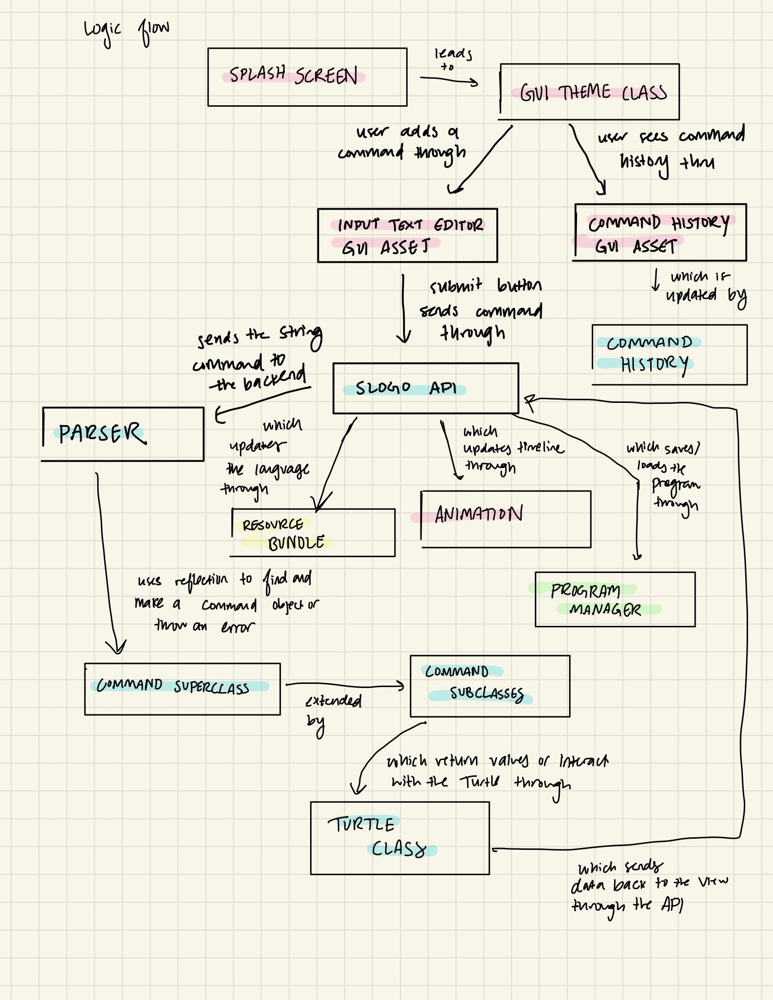
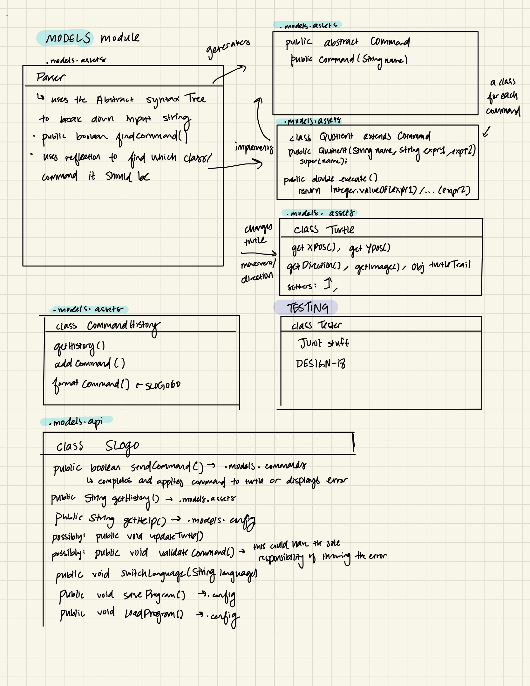
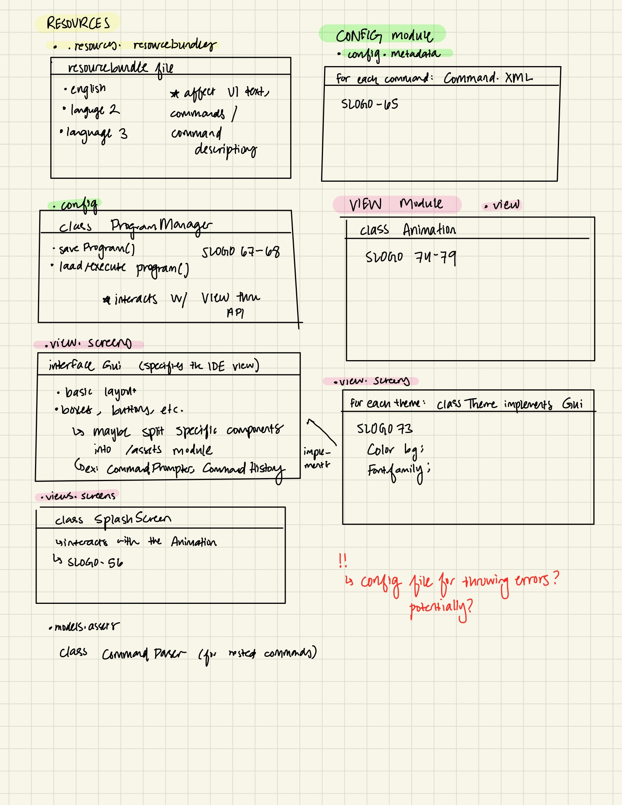

# SLogo Design Plan

### NAMES: Saad, Yasha, Yinuo, Divyansh

### TEAM: 6

## Introduction

* Problem: Developing a simple IDE that parses sLogo (simplified version of Logo) and animates
  a turtle object on the screen.

* The IDE should load a set of pre-existing commands
* The IDE should allow for the user to make custom commands - with command keys different from
  default commands
* The IDE should allow the use of variables for storing and loading data
* The IDE should save a history of commands and variables created
* The IDE should allow for the implementation of some basic math operations
* The IDE should allow the user to implement a turtle animation using the program and the above
  tools

* Overall architecture:
    * The program is made up of three main components each responsible for:
        * loading, handling and saving the xml command files
        * GUI
        * backend - the implementation of the functionality of the commands and the changes
          of the state of different parts of the program

* Flexibilities:
    * regarding the addition of extra default commands
    * regarding the addition of extra windows/display items
    * regarding the addition of extra interaction with the user (i.e. beyond step/pause/play)

## Configuration File Format

#### Example 1

```xml
<command1>
    <name>canonical name</name>
    <description>command description</description>
    <example>command example</example>
    <help>
        <paramters>
            <parameter1>parameter information</parameter1>
            <parameter2>parameter information</parameter2>
        </paramters>
        <return>value and information</return>
        <category>command category</category>
    </help> 
    <parameter_number>the number of parameters</parameter_number>
    <class>implementing class</class>
    <method>implementing method</method>
</command1>
```

#### Example 2

```xml
<command2 name="canonical_name">
    <description>command description</description>
    <example>command example</example>
    <help>
        <parameters>all the information about the parameters</parameters>
        <return>value and information</return>
        <category>command category</category>
    </help> 
    <parameter_number>the number of parameters</parameter_number>
    <implementation class="implementing_class">implementing method</implementation>
</command2>
```

## Design Overview

* Our design consists of 3 modules: view, model, and config. The front-end (view) interacts with our
  back-end (model and config) through the use of a public API class. It contains numerous methods
  that
  connect all parts of the game but do so by providing an abstraction that shields the user from
  knowing
  the inner workings of our backend implementation.
* Each command belongs to a subclass of the Command superclass. Our api will send a String command
  to
  the backend Parser and create/assign a Command subclass through the use of reflection.
* Logic flow: 

## Design Details

* Model module:
    * We will have an abstract class called Command that all subclass Commands will extend from. It
      will
      be defined by the parameters it needs for its execution and an execute() method. Depending on
      the
      command, it will return an integer, boolean, double, etc. or interact directly with a Turtle
      object.
      Ideally, the execute() method can serve as an abstraction for all subclasses.
    * Our Turtle class defines the movement, position, direction, etc. of our turtle within our Gui.
      This
      will help us in creating drawings and updating the position data dynamically to the Gui.
    * The Parser class will use an Abstract Syntax tree or some other relevant parsing data
      structure that
      will follow regex patterns to adequately determine if the command is valid, and if it is,
      which command
      it is. It will then use reflection to assign the command it dissected from the user to a
      correct subclass,
      and it will send the data returned/created by the subclass's execute() command back to the
      API.
    * Our API serves as abstraction for our entire backend module. The View can only interact with
      the backend
      through the public methods in our API, which do not reveal any implementations or existences
      of our command
      subclasses, our turtle object, or our config files like the ProgramManager. The API only
      interacts with
      the backend classes through methods and does not mutate any class.
* View module:
    * Our view consists of a Gui abstract class that uses several Gui components such as a
      CommandHistory window
      and and an input CommandTextEditor. The CommandHistory asset displays the history of commands
      for this session
      which is data that it collects from an API call to the backend CommandHistory file, which
      stores this history.
      CommandTextEditor allows the user to dynamically type any command, hit submit, and send this
      data to the backend
      through our API method sendCommand().
        * A note: our diagram says Gui is an interface, but it should be an abstract class.
    * Each theme (Dark/Light or Duke/UNC) implements the Gui abstract class as a themed subclass.
    * Our Animation class functions as the timeline manager for the entire program. It is
      dynamically updated through the
      API whenever a command is sent to the back and changes the configuration of the turtle object.
* Our diagrams:
    * 
    * 
* Config module:
    * The config module contains our XML files with metadata on each command, as specified above. It
      also
      contains a class called ProgramManager that manages the saving/retrieval of files and
      interacts with the
      timeline in view through the API.

## Design Considerations

During our meetings before starting to implement the design plan for
SLOGO, we had extensive discussions on several areas of the project and
how we wanted to implement them. We had several design consideration
on API structure, instruction type organization, error command handling, and the scope
of APIs. We talked about the merits and demerits of each of them and made some preliminary
decisions.

Here are some of the detailed discussions we had:

### 1. API for Turtle Movements

#### Single API (e.g., `updateTurtle()` or `sendCommand()`):

##### Pros:

- Simplifies the interface between the front end and the model.
- Easier to manage and extend as new commands are added.
- Reduces the number of methods the front end needs to interact with.

##### Cons:

- May require more complex parsing and handling in the back end to differentiate commands.
- Offers less granularity in controlling turtle movements from the front end.

#### Multiple APIs for Individual Movements (e.g., `moveLeft()`, `moveRight()`):

##### Pros:

- Provides more direct control and clarity on what each API call performs.
- Easier to implement and debug specific turtle movements.

##### Cons:

- Increases the number of methods to maintain.
- Can clutter the API with too many specific functions.

A single API to handle all turtle commands aligns with core design principles of keeping a
clean separation between the model and view (DESIGN-09), and
avoids exposing too many implementation details (DESIGN-10).

### 2. Separation of Different Instruction Types

##### Pros:

- Organizes code into clear, logical groupings which can simplify maintenance and extension.
- Allows for specialized error handling and optimization for each instruction type.

##### Cons:

- Might lead to code duplication if there is common functionality between different types.
- Could potentially create too many classes, making the system harder to navigate.

Our idea behind this consideration was that the project should
aim for a balance between separation and commonality,
abstracting shared behaviors and encapsulating unique ones,
in line with DESIGN-11 (Make and Use Abstractions).

### 3. Handling of Error Commands

#### Front End:

##### Pros:

- Immediate feedback to the user; can prevent bad commands from reaching the back end.

##### Cons:

- The front end might need knowledge about command syntax, which could violate the model-view
  separation.

#### Back End:

##### Pros:

- Keeps the command logic centralized; the back end can provide detailed error messages.

##### Cons:

- Errors only caught after command has been sent, potentially slowing down the user experience.

#### Config:

##### Pros:

- Allows for dynamic handling of errors based on configuration; can adapt to different languages and
  settings.

##### Cons:

- Might require a complex setup to ensure all components communicate errors consistently.

As of now, the most suitable approach that we have agreed on is to
involve handling syntax errors on the front end
and semantic or execution errors on the back end,
maintaining separation of concerns and allowing for
robust error handling as per DESIGN-15 (Handle Errors Using Exception Flows).

## Test Plan

- Strategies
    - Split the Parser, Backend, and Frontend.
    - Test for small functions before implement complicated extensions.
- Project features
    1. Parser
        - testEqual() suppose user types in "rt 20 rt 20 rt 30", test whether the program receive <
          20, 20, 30>
        - testReachBoundary() catch the maximum distance that the turtle can move "rd 100000" --> "
          rd maximum_distance"
        - testInvalidError() raise error for random input "@#%" --> "invalid_input"
    2. Backend Logic
        - testMove() given move forward commands -> assert the position of turtle is changed as
          expected
        - testRotate() given rotation commands -> assert the direction of turtle is changed as
          expected
        - testCreateTurtle() check the Turtle

## Team Responsibilities

* Team Member #1: Divyansh Jain
    * Handling the GUI implementation and frontend/config classes.

* Team Member #2: Yasha Doddabele
    * Handling the models/backend classes

* Team Member #3: Saad Hakim
    * Handling the implementation of GUI

* Team Member #4 Yinuo Guo
    * Handling the models/backend classes 
